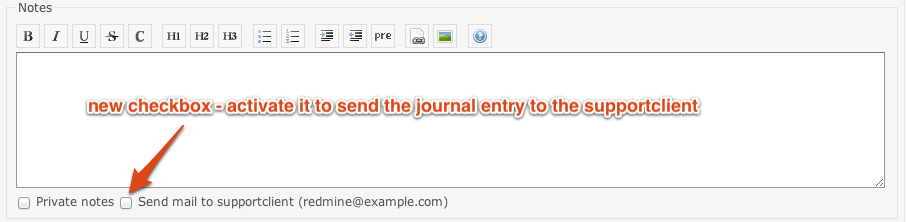
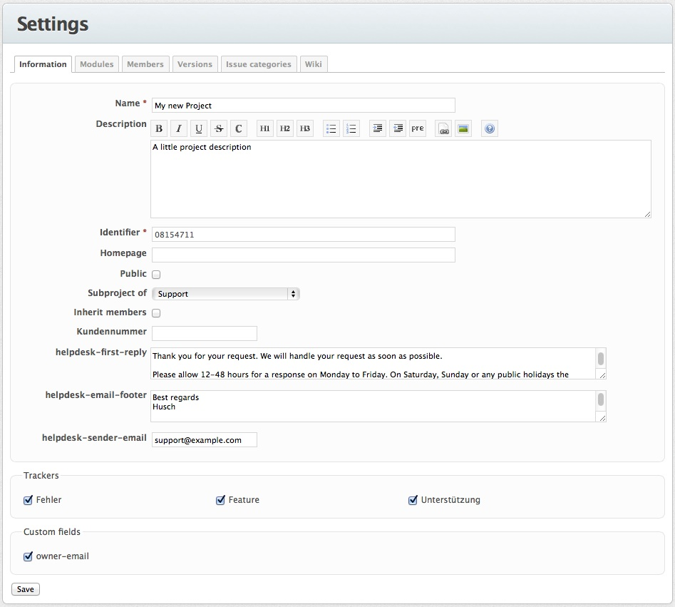

# Redmine Helpdesk

Lightweight helpdesk plugin for redmine. Adds the email sender-address of an anonymous supportclient to the custom field 'owner-email' of a ticket which was created by a support email. Answers can be send to the supportclient by checking the support checkbox on a journal.

## Features

* No need to create any user accounts for anonymous user
* Support for sending an email notification to the (anonymous user) supportclient on ticket creation
* A standard first reply message can be send to the supportclient on ticket creation (optional, per project)
* The email-footer for the email notification to the supportclient can be adjusted (optional, per project)
* The email-footer can be customized by using the following placeholders: 
  - Issue parameters
    - ##issue-id##
    - ##issue-subject##
    - ##issue-tracker##
    - ##issue-status##
  - Project parameters
    - ##project-name##
  - User parameters
    - ##user-name## 
    - ##user-firstname##
    - ##user-lastname##
    - ##user-mail##
    - ##user-login##
    - all user custom fields: ##user-cf-[user's custom field name]##, e.g. ##user-cf-position##
  - Base parameters
    - ##time-now##
* The sender email-address can be adjusted (optional, per project)
* Internal communication is not send to the supportclient
* The supportclient will get an email notification if the support checkbox on the journal is checked (default value is optional)
* Journal attachments will be delivered too
* Cc header is handled if the cc-handling checkbox is checked. (optional, per project)
* Reopening a closed issue is handled if the reopen-closed-issues-by-email checkbox is checked. (optional, per project)

## Screenshot



## Getting the plugin

A copy of the plugin can be downloaded from [GitHub](https://github.com/jfqd/redmine_helpdesk)

## Installation

To install the plugin clone the repo from github and migrate the database:

```
cd /path/to/redmine/
git clone git://github.com/jfqd/redmine_helpdesk.git plugins/redmine_helpdesk
bundle install --without development test rmagick
bundle exec rake redmine:plugins:migrate RAILS_ENV=production
```

To uninstall the plugin migrate the database back and remove the plugin:

```
cd /path/to/redmine/
rake redmine:plugins:migrate NAME=redmine_helpdesk VERSION=0 RAILS_ENV=production
rm -rf plugins/redmine_helpdesk
```

Further information about plugin installation can be found at: https://www.redmine.org/wiki/redmine/Plugins

## Usage

To use the helpdesk functionality you need to

* add the custom field 'owner-email' to a project in the project configuration
* add a standard first reply message into the custom_field 'helpdesk-first-reply' in the project configuration (optional)
* add an email-footer into the custom_field 'helpdesk-email-footer' in the project configuration
* add a sender email address into the custom_field 'helpdesk-sender-email' in the project configuration (optional)
* make sure 'Issue added' and 'Issue updated' in the general redmine settings for email notifications are checked
* add the permission 'Treat as supportclient' to all roles you want to be treated as supportclient (the permission is automatically added to the 'Anonymous' role)
* disable standard notifications for non-anonymous supportclients to prevent their spamming (optional)
* add a cronjob for creating issues from support emails



## Cronjob

Creating tickets from support emails through an IMAP-account is done by a cronjob. If you are not familiar with cron you first should read about the concept. The following syntax is for ubuntu or debian linux:

```
*/5 * * * * redmineuser /path/to/your/rake -f /path/to/redmine/Rakefile --silent redmine:email:receive_imap RAILS_ENV="production" host=mail.example.com port=993 username=username password=password ssl=true project=project_identifier folder=INBOX move_on_success=processed move_on_failure=failed no_permission_check=1 unknown_user=accept 1 > /dev/null
```

Further information about receiving emails with redmine can be found at: [https://www.redmine.org/projects/redmine/wiki/RedmineReceivingEmails](https://www.redmine.org/projects/redmine/wiki/RedmineReceivingEmails#Fetching-emails-from-an-IMAP-server)

Please note that forwarding emails with **rdm-mailhandler.rb** is currently **not supported** by the plugin.

## Compatibility

The latest version of this plugin is only compatible with Redmine 4.2.x.

* A version for Redmine 4.0.x is tagged with [v4.0](https://github.com/jfqd/redmine_helpdesk/releases/tag/v4.0 "plugin version for Redmine 4.0.x") and available for [download on github](https://github.com/jfqd/redmine_helpdesk/archive/v4.0.zip "download plugin for Redmine 4.0.x").
* A version for Redmine 3.0.x and 3.1.x is tagged with [v3.1](https://github.com/jfqd/redmine_helpdesk/releases/tag/v3.1 "plugin version for Redmine 3.0.x and 3.1.x") and available for [download on github](https://github.com/jfqd/redmine_helpdesk/archive/v3.1.zip "download plugin for Redmine 3.0.x and 3.1.x").
* A version for Redmine 2.4.x and 2.5.x is tagged with [v2.5](https://github.com/jfqd/redmine_helpdesk/releases/tag/v2.5 "plugin version for Redmine 2.4.x and 2.5.x") and available for [download on github](https://github.com/jfqd/redmine_helpdesk/archive/v2.5.zip "download plugin for Redmine 2.4.x and 2.5.x").
* A version for Redmine 2.3.x is tagged with [v2.3](https://github.com/jfqd/redmine_helpdesk/tree/v2.3 "plugin version for Redmine 2.3.x") and available for [download on github](https://github.com/jfqd/redmine_helpdesk/archive/v2.3.zip "download plugin for Redmine 2.3.x").
* A version for Redmine 1.2.x. up to 1.4.7. is tagged with [v1.4](https://github.com/jfqd/redmine_helpdesk/tree/v1.4 "plugin version for Redmine 1.2.x up to 1.4.7") and available for [download on github](https://github.com/jfqd/redmine_helpdesk/archive/v1.4.zip "download plugin for Redmine 1.2.x up to 1.4.7").

If you prefer to run Redmine with JRuby make sure to use Redmine versions prior to 3.0.x!

## Development

### Testing

Rake tasks for testing against Redmine are provided. Redmine is installed under `test/app` and tests are run against the local instance.

```bash
REDMINE_VERSION=3.2 DATABASE_ADAPTER=mysql rake helpdesk:redmine:install
```

Docker is used to provide local MySQL (`DATABASE_ADAPTER=mysql`) and PostgreSQL (`DATABASE_ADAPTER=postgresql_ext`) instances.

```bash
export DATABASE_ADAPTER=mysql
rake helpdesk:prepare_local
rake helpdesk:migrate
```

Test suite can be executed with:

```bash
DATABASE_ADAPTER=mysql rake helpdesk:ext_ci
```

The local database instance has to be stopped with a rake task:

```bash
rake helpdesk:localdb:stop
```

## Contributions

* [gianpaol0](https://github.com/gianpaol0) - italian translation
* [mgeerdsen](https://github.com/mgeerdsen) - Fix reopening closed issue error
* [mgeerdsen](https://github.com/mgeerdsen) - Improve de locale
* [lmorillas](https://github.com/lmorillas) - Fix Error when message hasn't "To:" header
* [promasu](https://github.com/promasu) - Add X-Redmine-Issue-Tracker header to mailerpatch
* [ANemcov](https://github.com/ANemcov) - incorrect issue and project ids usage
* [ismaelgc](https://github.com/ismaelgc) - Spanish translation
* [monaka](https://github.com/monaka) - Japanese translation
* [avoidik](https://github.com/avoidik) - Add missed Russian translation into roles and access manager
* [WhereIsPedro](https://github.com/WhereIsPedro) - Polish translation
* [vilppuvuorinen](https://github.com/vilppuvuorinen) - 3.0.x compatibility
* [vilppuvuorinen](https://github.com/vilppuvuorinen) - Unit and functional tests with travis and code climate support
* [ssidelnikov](https://github.com/ssidelnikov) - Make sure that the notes length is always calculated
* [nifuki](https://github.com/nifuki) - Fixed bug trying to send an email with empty notes
* [nifuki](https://github.com/nifuki) - Fixed non-working helpdesk-send-to-owner-default checkbox
* [box789](https://github.com/box789) - Russian translation
* [seqizz](https://github.com/seqizz) - Turkish translation
* [benstwa](https://github.com/benstwa) - 'send' should be 'sent'
* [davidef](https://github.com/davidef) - Add setting for handling sent to owner default value
* [Craig Gowing](https://github.com/craiggowing) - Redmine 2.4 compatibility
* [Barbazul](https://github.com/barbazul) - Added reply-to header
* [Orchitech Solutions](https://github.com/orchitech) - Added issue matching based on standard MIME header references
* [Orchitech Solutions](https://github.com/orchitech) - Added support for non-anonymous supportclients (sponsored by ISIC Global Office)
* [Orchitech Solutions](https://github.com/orchitech) - Added support for customizable email footers (sponsored by ISIC Global Office)
* [Orchitech Solutions](https://github.com/orchitech) - Added support for tracking email details (sponsored by ISIC Global Office)
* [shackijj](https://github.com/shackijj) - Added Cc header handling
* [archonwang](https://github.com/archonwang) - Add Simplified Chinese
* [Niremizov](https://github.com/Niremizov) - Set owner email only if it wasn't set before
* [ghost](https://github.com/ghost) - Fix attachements truncated in email sent to supportclient
* [Orchitech Solutions](https://github.com/orchitech) - Added support for reply separator (sponsored by ISIC Global Office)

## License

This plugin is licensed under the MIT license. See LICENSE-file for details.

## Copyright

Copyright (c) 2012-2022 qutic development GmbH
